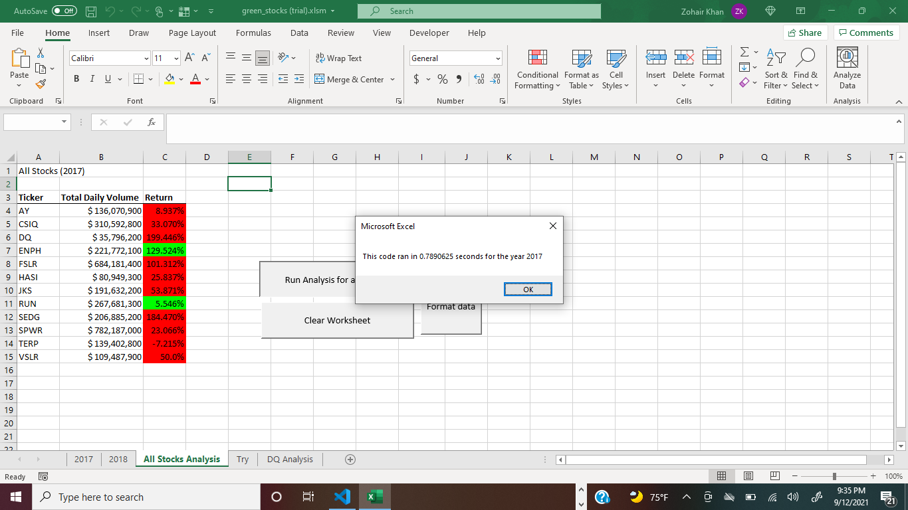
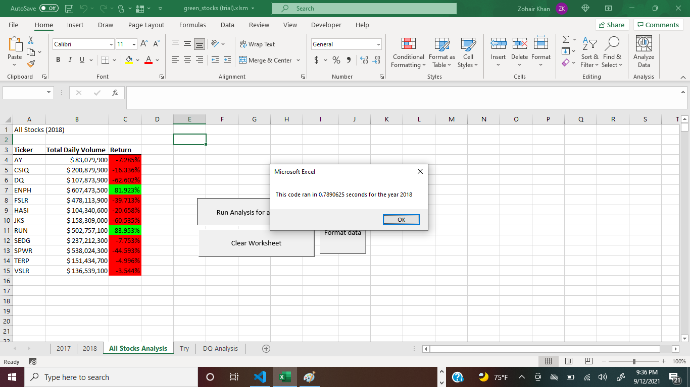
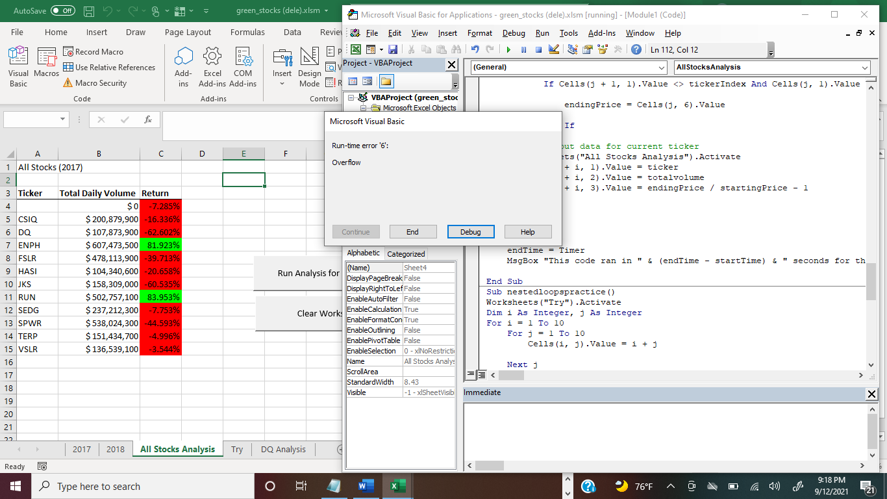

# Stock-Analysis
### Steve VBA research to find financialy good and stable companies for his parents' benefits to invest their shares in.

---
## Overview of Project
### ***The purpose and background :***
The purpose of Steve VBA's excel-project was to find the company that is in its good financial condition for Steve's parents to invest their shares in. As steve was dealing with large amount of data that has the info on stocks -- its prices and its volumes-- in short span of time before his parents irrationally make a final decision to give their shares to the company name "DQ", Steve used his VBA skills to find the best company for his parents' benefits. 
### ***Results:***
 Both years (2017 and 2018) show that the companies with the ticker names "RUN" and "ENPH", respectively, have shown a sound background in their financial statuses as compared to the remaining companies. However, the year 2017 was a successful one for the company "ENPH" with the highest returns. "RUN" did show some good financial statnding but it was not in competitive level to "ENPH". In 2018, the copmayies' financial situation is flipped. RUN has relatively better financial standing than that of "ENPH". 

### ***The analysis is well described with screenshots and code:***
This challenge was based on the analysis by concentrating on the time it takes for Excel to compute and produce its results by using the ***for*** multiple loops nested into one another in lesser time as compared to class work's VBA's codes. 
### ***Summary***
#### *There is a detailed statement on the advantages and disadvantages of refactoring code in general:*
It has the 100 percent potential to put its coder in getting lost in a lot of information and thus facing the risk of erros like: Compile, runtime 6 error etc. Therefore, this is the biggest disadvantage. the two screen shots for the years are the proof: 

#### *There is a detailed statement on the advantages and disadvantages of the original and refactored VBA script:*

The advantage of the origin script is that the nested loops perfectly match to give the desired results. On the other hand, this challenge expected us to create a lesser time results by creating a ticker array from the tickerIndex array. Then TickerIndex array is expected to be looped to the arrays: totVolume, Starting price and ending price. This refactoring-expectation was impractical as there was no possible loop to connect the ticker array to the created array (tickerIndex) then connect it back to ticker. Hence, the results are lots of errors. 
